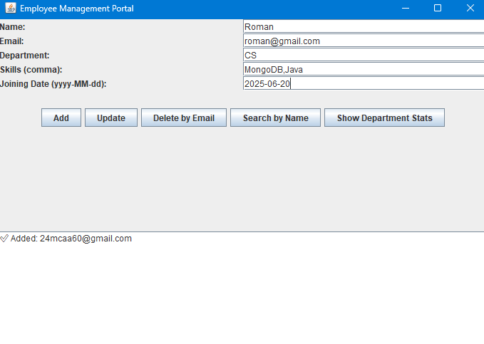
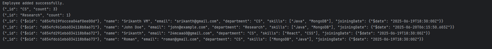

#  Employee Management Portal

A Java + MongoDB-based desktop application with a Swing GUI to manage employee records efficiently.

##  Features

-  Add new employees
-  Update employee details
-  Delete employees by email
-  Search employees by name
-  Show department-wise employee statistics
-  Automatically clears form after actions
-  Easy-to-use Swing-based GUI

##  Tech Stack

- **Java 17+**
- **MongoDB (NoSQL Database)**
- **Swing (Java GUI Toolkit)**
- **Maven** for dependency management

  
##  Screenshots

- Below is the screenshot of Adding an employee.

- Below is the screenshot of Department wise data output.

